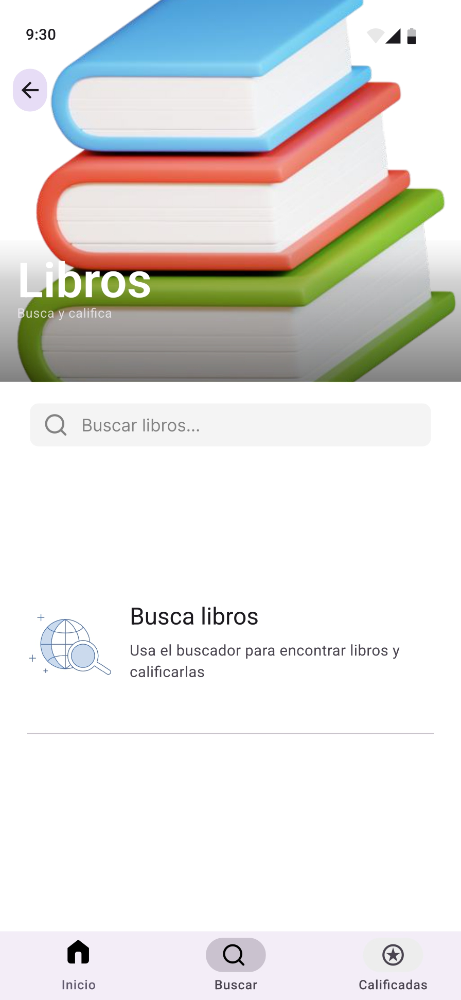

# Diseño de interfaz de usuario

La aplicación tendrá la siguientes pantallas

1. Pantalla 1: Login

2. Pantalla 2: Iniciar Sesión

3. Pantalla 3: Registrarse

4. Pantalla 4: Inicio 

5. Pantalla 5: El buscador de películas

6. Pantalla 6: El buscador de Series

7. Pantalla 7: El buscador de libros

8. Pantalla 8: Calificación que el usuario previamente le ha dado a las películas, series y libros

# Referencias

- [Material Design: Foundations](https://m3.material.io/foundations)
- [Material Design: Style](https://m3.material.io/styles)
